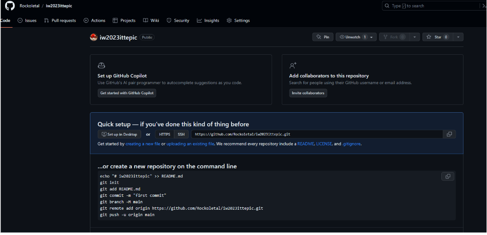
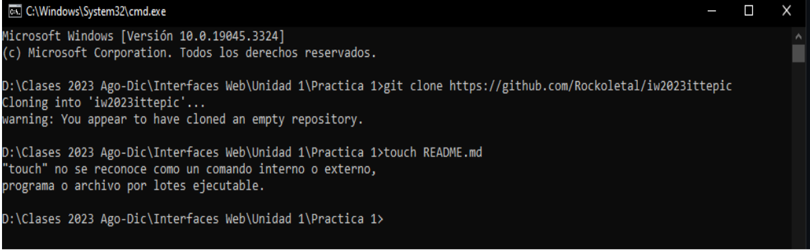
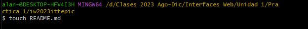
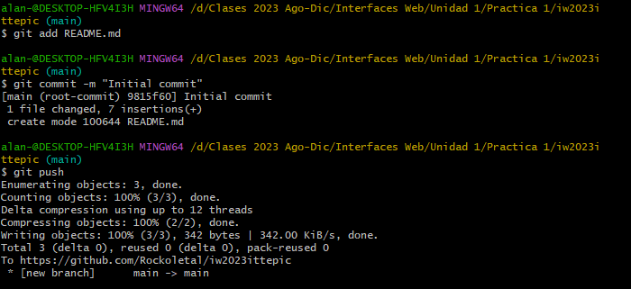
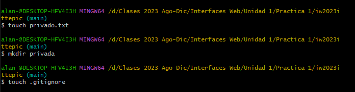
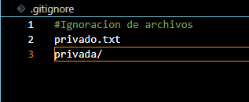
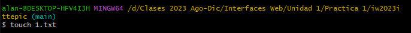
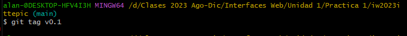
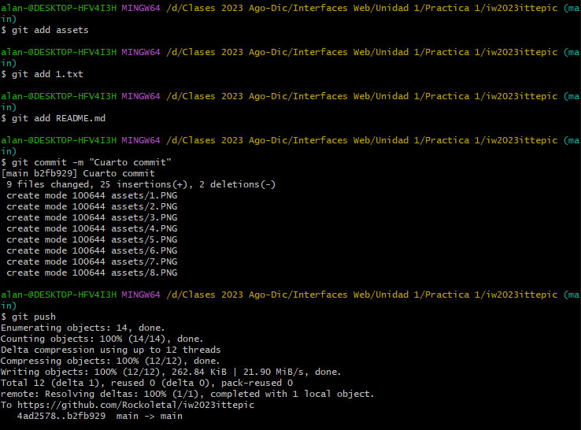

Practica 1  - GIT
1.- Creacion de repositorios en git
    1.1 Clonacion de la carpeta
    git clone https://github.com/Rockoletal/iw2023ittepic

    

    1.2 Conar el repositorio en local
    
    

2. Creacion del archivo README.md
    touch README.md

    

3. Agregamos los siguientes comandos para hacer el primer commit
    git add README.md
    git commit -m "Initial commit"
    git push

    

4. Ignorar archivos 
    4.1 Crear en el repositorio local un fichero llamado privado.txt
        touch privado.txt
    4.2  Crear en el repositorio local una carpeta llamada privada
        mkdir privada
    4.3  Realizar los cambios oportunos para que tanto el archivo como la carpeta sean ignorados por git

    

    Informacion que tienes que poner en el archivo .gitignore

    

5. Añadir archivo
    5.1 Añadir archivo 1.txt al repositorio local
        touch 1.txt
    
       

6. Creacion de TAG
    6.1 Crea un tag v0.1
        git tag v0.1

           

7. Subir cambios
    7.1 Subir los cambios al repositorio remoto

      

8. Creacion de tabla
    8.1 Crear una tabla con la información de al menos 5 de tus compañeros de clase

| Nombre | Github |
| ------------ | ------------ | 
| GRAXIOLA QUIROZ JUAN ANTONIO | https://github.com/Railgun124 |
| CALVARIO RAMÍREZ JOSÉ | https://github.com/JoseCalvario8 |
| CARRILLO RUBIO JOSÉ GIOVANNI | https://github.com/GiovanniCarrillo |
| RAZON MACHAIN BRYAN PAUL | https://github.com/PaulRazon |
| RAMOS RIVERA ANDRÉS SEBASTIAN | https://github.com/andrestian01 |

